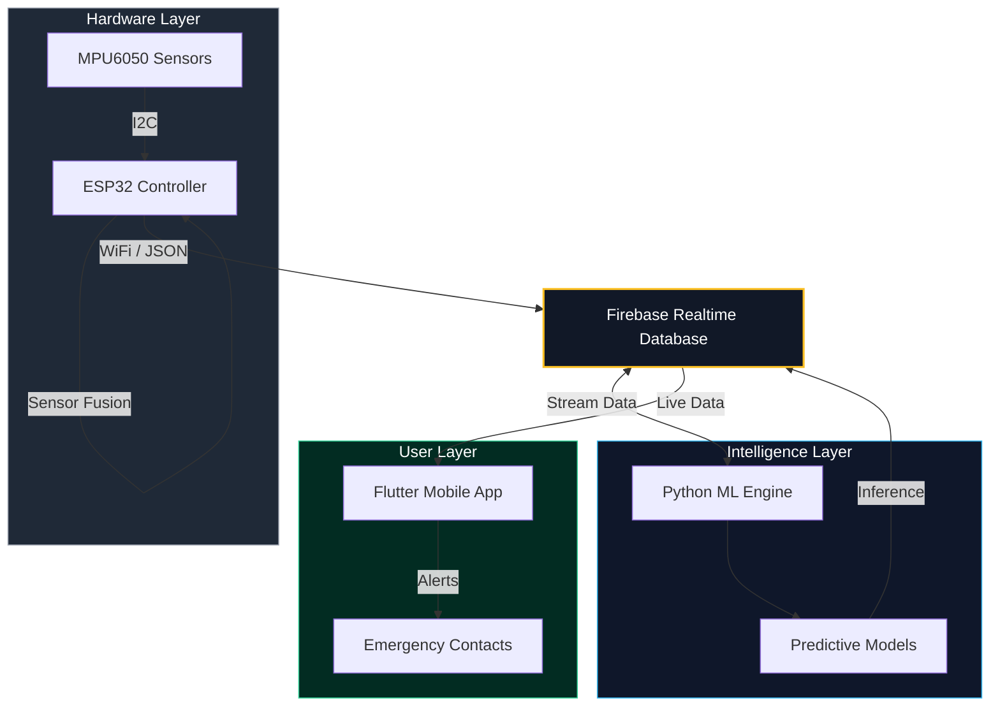

<div align="center">


# 🛡️ Aegis Guardian

**Next-Gen IoT Accident Detection & Response System**
<p align="center">
  <a href="#architecture">View Architecture</a> •
  <a href="#ml-models">ML Models</a> •
  <a href="#app-gallery">App Gallery</a> •
  <a href="#setup">Getting Started</a>
</p>
</div>

---

## Project Overview

**Aegis Guardian** is a life-saving IoT ecosystem designed to detect vehicle accidents, monitor human activity, and analyze heart health in real-time. It bridges the gap between hardware sensors and cloud intelligence to provide autonomous emergency response.

### Key Features

* **Instant Crash Detection:** Uses MPU6050 accelerometer & gyroscope data to identify impacts.
* **ECG Heart Analysis:** Neural network-based classification of 5 different heartbeat types.
* **Human Activity Recognition:** Distinguishes between 13 activities (Running, Falling, Sitting, etc.).
* **Cloud Sync:** Real-time bi-directional telemetry via **Firebase Realtime Database**.
* **Guardian App:** Cross-platform (Flutter) interface for family monitoring, live tracking, and health metrics.

---
<a id="architecture"></a>
##  System Architecture
The system operates on a "Sense-Think-Act" loop distributed across Edge (ESP32), Cloud (Firebase), and Client (App).



<a id="ml-models"></a>
##  Machine Learning Core

The intelligence of Aegis Guardian relies on three distinct models located in the `backend/` directory.

### 1. ECG Heartbeat Classification (`ecg_heartbeat_.ipynb`)
A **Neural Network** designed to identify heart conditions based on ECG waveforms.
- **Input:** 187 numerical features representing a single heartbeat waveform.
- **Output:** Probability distribution over 5 classes.
- **Classes:**
  - `0`: Normal Beats
  - `1`: Supraventricular ectopic beats
  - `2`: Ventricular ectopic beats
  - `3`: Fusion Beats
  - `4`: Unknown Beats

### 2. Binary Fall Detection (`fallDetection_fall_nofall.ipynb`)
A **Random Forest Classifier** optimized for critical safety alerts.
- **Goal:** Distinguish between a fall event and normal movement.
- **Input:** 9 sensor readings (features).
- **Performance:** Achieved **97.19% Accuracy** on test data.
- **Output:** Binary Class `1` (Fall) or `0` (No Fall).

### 3. Multi-Class Activity Recognition (`fallDetection_MultiClassModel.ipynb`)
A comprehensive system to classify human behavior using raw sensor features (max acceleration, gyro kurtosis, etc.).
- **Algorithm:** Random Forest Classifier.
- **Performance:** **72.47% Accuracy** across 13 complex classes.
- **Classes:** 
  - `BSC` (Bike Slow Cycling), `CSI` (Car Slow Driving), `CSO` (Car Stop Driving)
  - `FKL` (Falling), `FOL` (Falling on Ground)
  - `JOG` (Jogging), `JUM` (Jumping), `WAL` (Walking)
  - `SCH` (Sitting Chair), `SDL` (Sitting Down), `STD` (Standing), `STN` (Standing Normally), `STU` (Standing Up)
- **Deployment Components:**
  - `activity_rf_model.joblib`: The trained model for inference.
  - `activity_scaler.joblib`: The StandardScaler required to preprocess new sensor data.

---

<a id="app-gallery"></a>
## Mobile App Gallery
> *Built with Flutter. Features a high-contrast 'Dark Mode' for low-light visibility during emergencies.*

<div align="center">
  
  
   
</div>

---

## Repository Structure

| Folder | Content | Tech Stack |
| :--- | :--- | :--- |
| **[`/firmware`](./firmware)** | ESP32 logic, sensor fusion, & network code. | **C++, Arduino** |
| **[`/backend`](./backend)** | Jupyter Notebooks (`.ipynb`) for ECG, Fall, & Activity models. | **Python, TensorFlow, Sklearn** |
| **[`/mobile-app`](./mobile-app)** | The Guardian Angel mobile application source code. | **Flutter (Dart)** |
| **[`/docs`](./docs)** | Project presentations and wiring diagrams. | **Documentation** |

---

<a id="setup"></a>
## Getting Started

### 1. Firmware Setup (ESP32)
1. Navigate to `firmware/Aegis_esp32/`.
2. Rename `secrets_template.h` to `secrets.h`.
3. Add your WiFi credentials and Firebase URL:
   ```cpp
   #define WIFI_SSID "YOUR_WIFI_NAME"
   #define WIFI_PASSWORD "YOUR_WIFI_PASS"
   #define DATABASE_URL "YOUR_FIREBASE_URL"
4. Flash the code to your ESP32 using Arduino IDE.

### 2. Backend Setup (Python)

To run the analysis models locally:

```bash
cd backend
pip install -r requirements.txt
jupyter notebook
```


---

*Created for the Aegis Guardian Initiative. 2026.*
